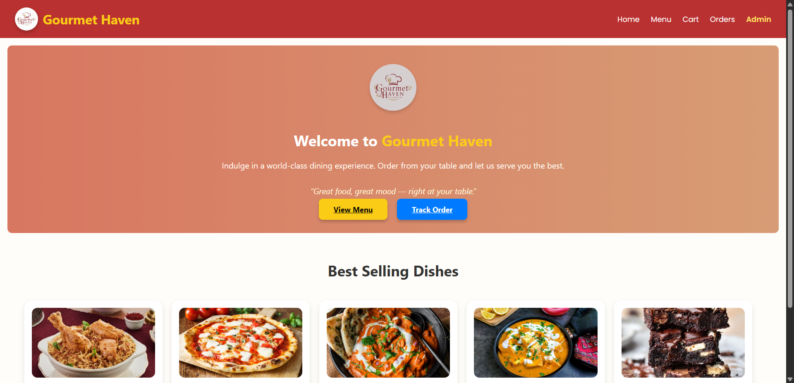
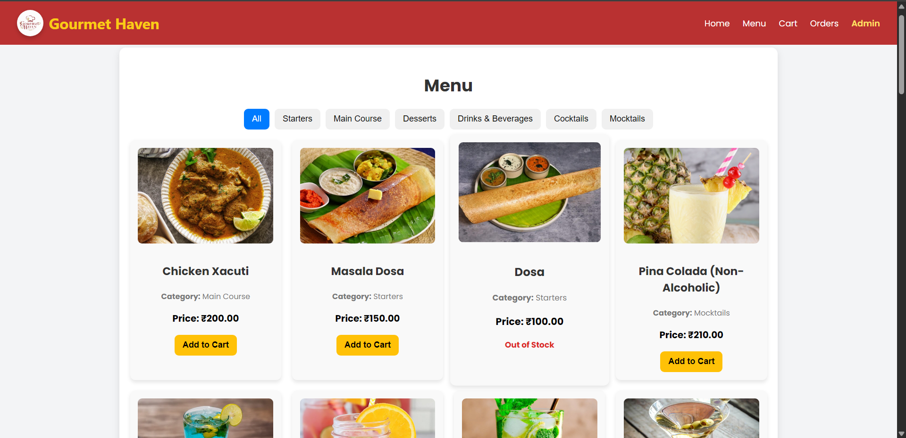
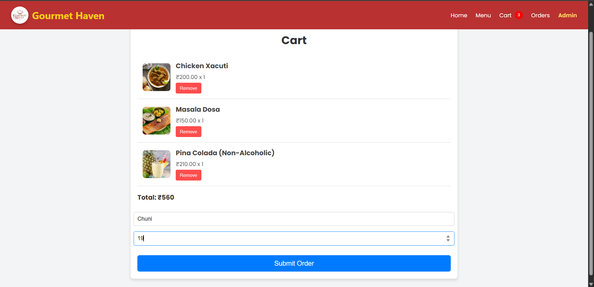
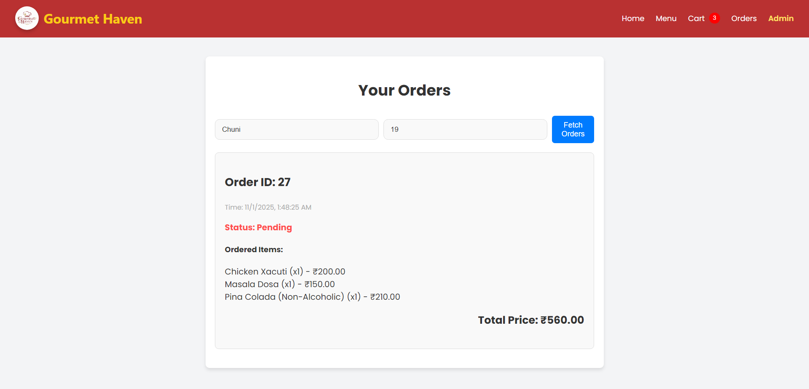
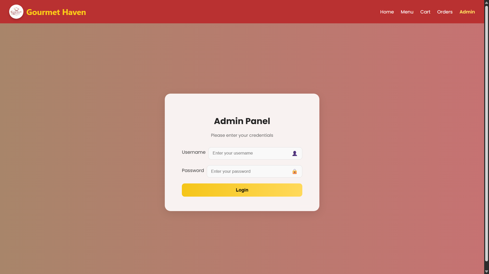
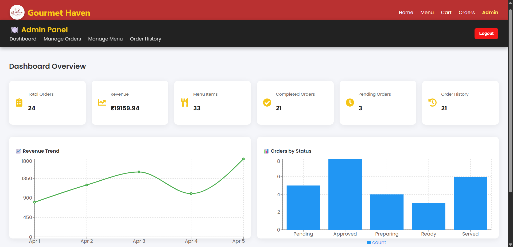
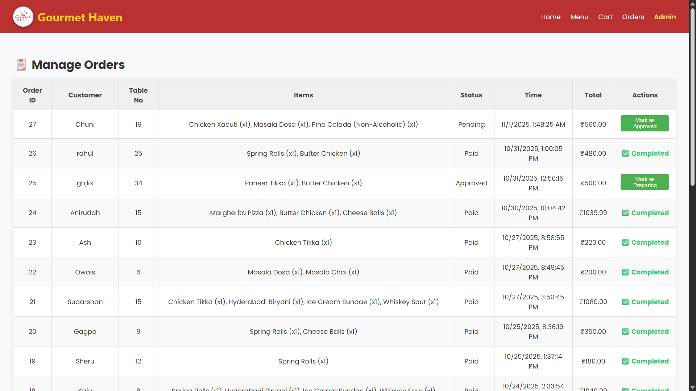
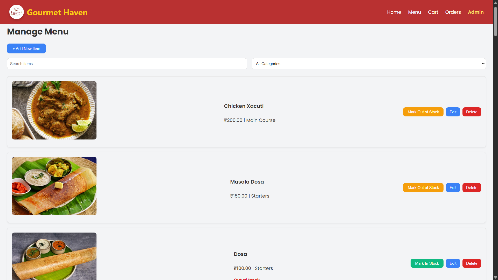
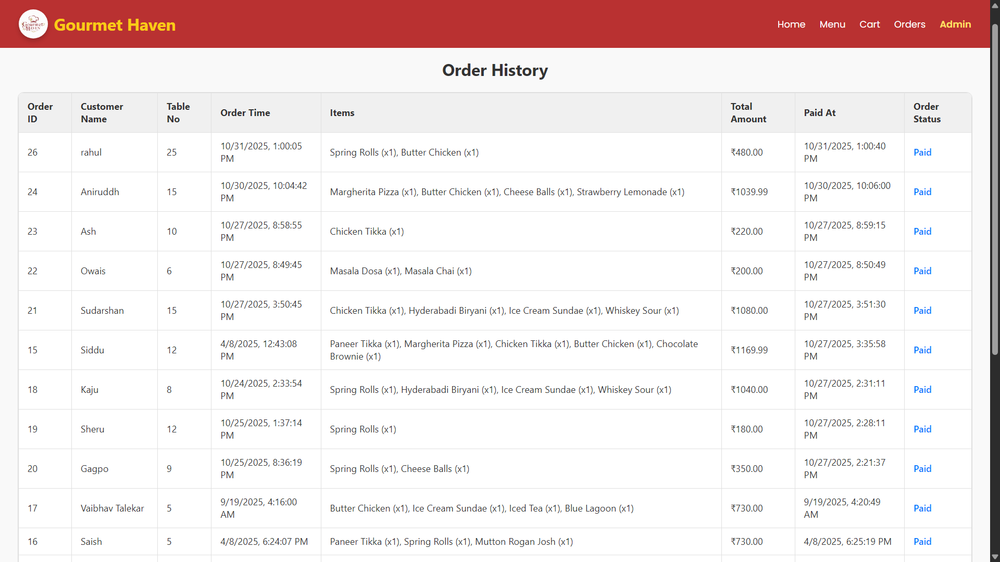

## 📸 Project Screenshots

### 🏠 Customer Interface





### 🧑‍💼 Admin Interface






# 🍽️ Restaurant Management System (Cloud-Based)

A **full-stack restaurant management web application** built using **React.js**, **Node.js (Express)**, **MySQL**, and **Azure Cloud Services**.  
This system enables customers to place orders from their tables, while the admin manages menu items, tracks order statuses, and handles billing — all through a clean and modern interface.

---

## 🚀 Features

### 🧾 Customer Side
- View categorized menu items (Starters, Main Course, Desserts, Drinks, etc.)
- Add items to cart and place orders with table number and name
- See live order status updates: **Pending → Approved → Preparing → Ready → Served**
- View total bill before submission

### 🔑 Admin Panel
- **Secure login** with database-backed authentication
- **Manage Orders:** Approve, update, or delete orders
- **Order Timeline:** Track and update status in real-time
- **Billing System:** Mark orders as *Paid & Done*
- **Order History:** View completed orders with filters by date and time
- **Menu Management:** Add, edit, or delete menu items, manage stock visibility
- **Dashboard Analytics:** Display total orders, revenue, menu count, and charts (via Recharts)

---

## ☁️ Cloud & Deployment

### Azure Cloud Integration
- **Azure MySQL Flexible Server** → Database backend  
- **Azure App Service** → Hosting Node.js backend  
- **Azure Blob Storage** → Secure storage of food images (private container with SAS token access)  
- **Azure Static Web Apps** → Hosting React frontend  

### Private Container Access
- Images are stored in **private Azure Blob Storage**.
- SAS tokens are generated dynamically via backend (`blobServices.js`) for secure temporary access.

---

## 🧰 Tech Stack

| Layer | Technology |
|-------|-------------|
| Frontend | React.js, Tailwind CSS, Recharts |
| Backend | Node.js, Express.js |
| Database | MySQL (Azure MySQL Flexible Server) |
| Cloud Storage | Azure Blob Storage |
| Hosting | Azure App Service + Azure Static Web Apps |
| Authentication | Admin users stored in MySQL with password hashing |
| Charts & Visualization | Recharts |

---

## ⚙️ System Architecture

Customer → React Frontend → Express Backend → MySQL (Azure)
↳ Azure Blob Storage (Images)
↳ SAS URL Generation for secure access


---

## 🧑‍💻 Installation & Setup

### 1️⃣ Clone the Repository
```bash
git clone https://github.com/<your-username>/restaurant-management-system.git
cd restaurant-management-system

2️⃣ Backend Setup
cd backend
npm install

Create a .env file:
DB_HOST=your-azure-mysql-host
DB_USER=your-db-username
DB_PASSWORD=your-db-password
DB_NAME=restaurantdb
AZURE_STORAGE_CONNECTION_STRING=your-azure-storage-connection-string
AZURE_STORAGE_CONTAINER=menu-images
PORT=5000

Run the backend:
npm start

3️⃣ Frontend Setup
cd frontend
npm install
npm run dev


```
1️⃣ admin_users
| Field         | Type    | Description        |
| ------------- | ------- | ------------------ |
| id            | INT     | Primary key        |
| username      | VARCHAR | Admin username     |
| password_hash | VARCHAR | Encrypted password |

2️⃣ customers
| Field        | Type     | Description   |
| ------------ | -------- | ------------- |
| customer_id  | INT      | Primary key   |
| name         | VARCHAR  | Customer name |
| table_number | INT      | Table number  |
| created_at   | DATETIME | Timestamp     |

3️⃣ menu
| Field    | Type    | Description                     |
| -------- | ------- | ------------------------------- |
| item_id  | INT     | Primary key                     |
| name     | VARCHAR | Item name                       |
| category | VARCHAR | Food category                   |
| price    | DECIMAL | Item price                      |
| image    | VARCHAR | Azure Blob URL                  |
| in_stock | BOOLEAN | 1 = Available, 0 = Out of Stock |

4️⃣ orders
| Field         | Type     | Description                                                  |
| ------------- | -------- | ------------------------------------------------------------ |
| order_id      | INT      | Primary key                                                  |
| customer_name | VARCHAR  | Customer name                                                |
| table_number  | INT      | Table number                                                 |
| status        | ENUM     | Order progress (Pending, Approved, Preparing, Ready, Served) |
| total_amount  | DECIMAL  | Total bill amount                                            |
| created_at    | DATETIME | Order time                                                   |

5️⃣ order_items
| Field     | Type    | Description            |
| --------- | ------- | ---------------------- |
| id        | INT     | Primary key            |
| order_id  | INT     | Linked to orders table |
| item_name | VARCHAR | Item ordered           |
| quantity  | INT     | Quantity of item       |
| price     | DECIMAL | Item price             |

6️⃣ paid_orders
| Field        | Type     | Description   |
| ------------ | -------- | ------------- |
| id           | INT      | Primary key   |
| order_id     | INT      | Linked order  |
| name         | VARCHAR  | Customer name |
| table_number | INT      | Table number  |
| total_amount | DECIMAL  | Bill total    |
| paid_on      | DATETIME | Payment date  |

7️⃣ order_history
| Field        | Type     | Description          |
| ------------ | -------- | -------------------- |
| id           | INT      | Primary key          |
| order_id     | INT      | Linked order         |
| status       | ENUM     | Final order state    |
| completed_at | DATETIME | Completion timestamp |

8️⃣ payments
| Field      | Type     | Description       |
| ---------- | -------- | ----------------- |
| payment_id | INT      | Primary key       |
| order_id   | INT      | Linked order      |
| amount     | DECIMAL  | Amount paid       |
| method     | VARCHAR  | Payment method    |
| paid_at    | DATETIME | Payment timestamp |

💰 Cost Analysis (Azure Cloud)
Service	Description	Estimated Monthly Cost
Azure App Service (Backend)	Node.js app hosting (Basic B1 Plan)	₹750 – ₹900
Azure Static Web App (Frontend)	React app hosting	₹0 (Free tier)
Azure MySQL Flexible Server	Basic tier 1 vCore, 20 GB storage	₹1,200 – ₹1,500
Azure Blob Storage	Private image container, 5 GB	₹50 – ₹100
Total Monthly Cost	(Approx.)	₹2,000 – ₹2,500

💡 Costs may vary based on traffic, storage, and compute usage.
This setup is suitable for small restaurants or prototype deployments.

📊 Dashboard Preview

Total Orders

Revenue (Line Chart)

Order Status Overview (Bar Chart)

Order History Table

🛠️ Future Enhancements

Add customer feedback & rating system

Enable push notifications for order status updates

Integrate UPI/Online payment system

Role-based admin management

AI-based sales prediction reports

🧑‍🏫 Authors

Shreyash Parsekar (MCA Cloud Computing Project 2025)
Built using: React.js • Node.js • MySQL • Azure Cloud

Admin Credentials:

username: admin

password: gourmethaven@123

📄 License

This project is licensed under the MIT License — feel free to modify and use it.

🌐 Live Demo

🔗 (Deployed on Azure links here)

Frontend: https://restaurant-cloud-frontend-h3c2f2f4dfb4fjdd.centralindia-01.azurewebsites.net/

Backend API: https://restaurant-cloud-backend.azurewebsites.net/


